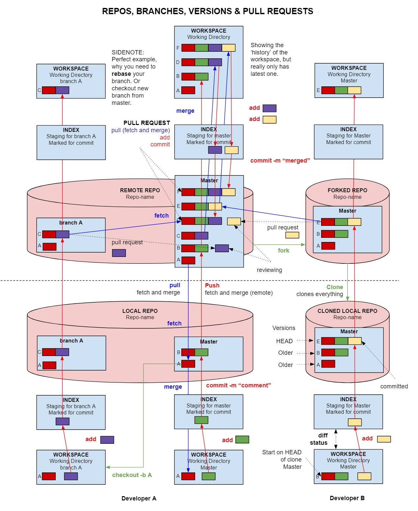
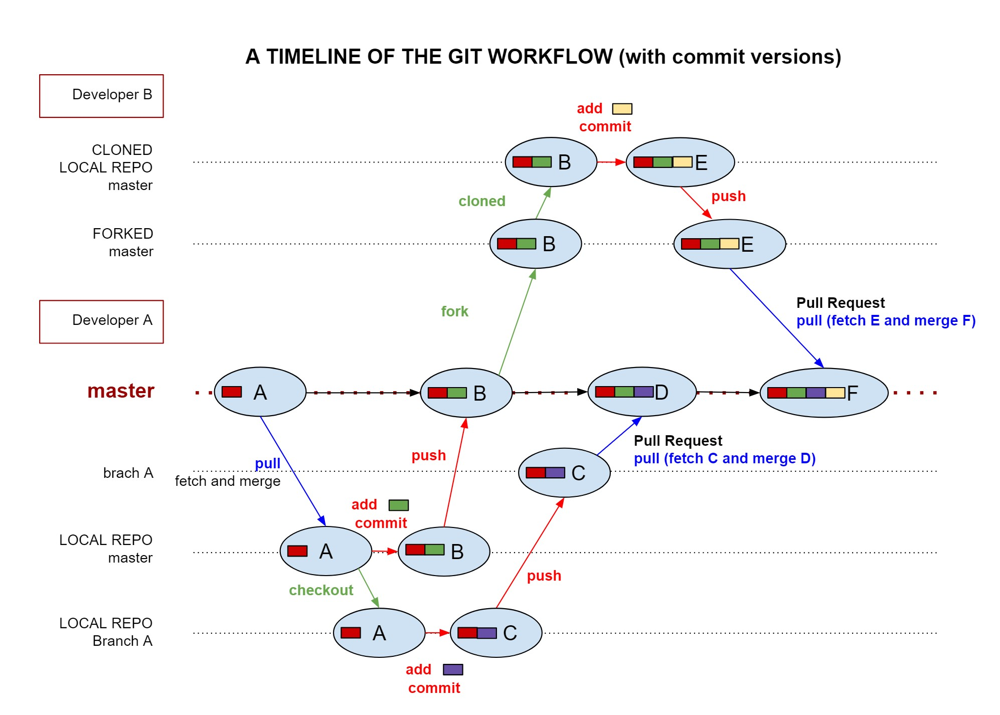
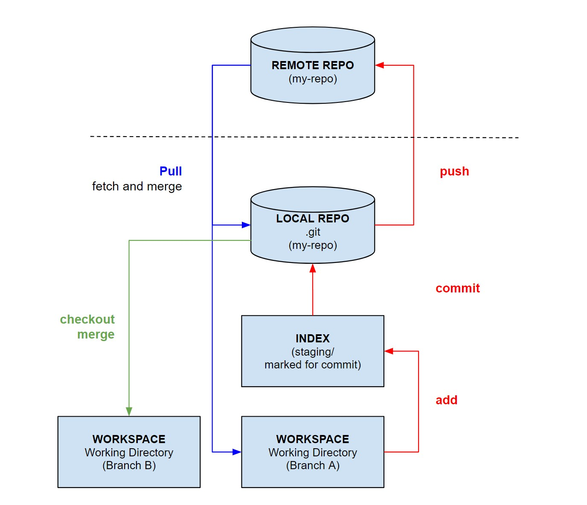
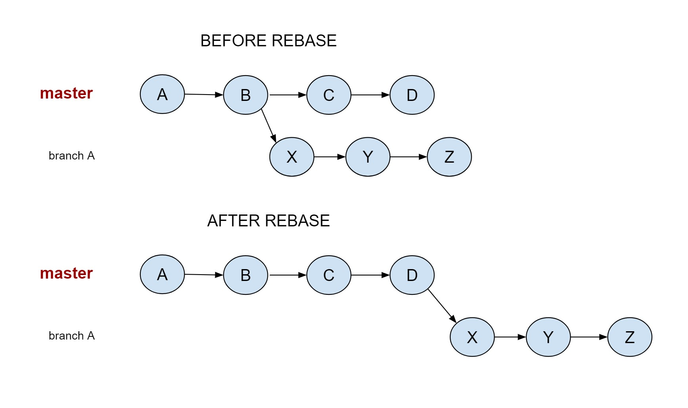

# GIT CHEAT SHEET

`git` _is a free and open source
DVCS (Distributed Version Control System) It is the largest host
of both open and private source code in the world._

Typically, it lives on your local machine (_local repos_) and on
GitHub.com (_remote repos_).

View my entire list of cheat sheets on
[my GitHub Webpage](https://jeffdecola.github.io/my-cheat-sheets/).

## INSTALL GIT LOCAL

### LINUX

Install from a package.  For example,

```bash
sudo apt install git
```

### WINDOWS

There are two main options,

Option 1. Stand alone, git for windows App (completely independent from
bash on ubuntu on windows)

```bash
https://git-scm.com/downloads
```

Option 2. Open bash on ubuntu on windows and install like linux above.

## CONFIGURE SOME SETTINGS

The global settings tell Github who you are,

I also like to add the hostname/machine name so I know where the
commits came from,

```bash
git config --global user.name "Jeff DeCola (<HOSTNAME / MACHINE NAME>)"
git config --global user.email <YOUR-EMAIL>
git config --global core.editor nano
```

Check your configuration,

```bash
git config --list
```

Or check the config file,

```bash
cat ~/.gitconfig
```

## HTTPS ACCESS (USING .netrc)

Generate a `personal access token` for your machine
at github.com (_Settings Developer -> Settings_).

Creating a `.netrc` file,

```bash
nano ~/.netrc
```

Add your token to this file,

```bash
machine github.com
login {TOKEN FROM GITHUB}
```

When in a repo working directory, you can set git to use https for access,

```bash
git remote set-url origin https://github.com/<YOUR-GIT-USERNAME>/REPONAME.git
```

Check your configuration for this repo,

```bash
git config --list
git remote -v
```

## SSH KEY (USING KEYS)

Generate public and private keys,

```bash
ssh-keygen -t rsa -b 4096 -C "Keys for Github"
```

Note, we are using a rsa type key with 4096 bit encryption.

Now add your key to your machine,

```bash
ssh-add ~/.ssh/id_rsa
```

Copy your public ssh key,

```bash
cat ~/.ssh/id_rsa.pub
```

Goto GitHub.com and paste your public ssh key (_settings -> ssh keys_)

You can check the fingerprint at Github against your local public key.
You may not need the md5 option,

```bash
ssh-keygen -E md5 -lf ~/.ssh/id_rsa.pub
```

With the above complete, now connect your key to GitHub,

```bash
ssh -T git@github.com
```

If you want to use a particular public key file,

```bash
ssh -i ~/.ssh/id_rsa.pub git@github.com
```

That's all there is to it.  Now we can use ssh with GitHub.
Like above, set git to use ssh on your local repo,
rather the https,

```bash
git remote set-url origin git@github.com:JeffDeCola/REPONAME.git
```

Check your settings,

```bash
git config --list
git remote -v
```

For more information about ssh, I wrote a cheat sheet
[ssh and keys](https://github.com/JeffDeCola/my-cheat-sheets/tree/master/development/operating-systems/linux/ssh-and-keys-cheat-sheet).

## INTERGRATE GIT WITH BASH PROMPT

It's nice to have your prompt tell you what
branch you are on and give other status information.

I use [git-aware-promp](https://github.com/jimeh/git-aware-prompt).

## WORKFLOW

The Git Work flow, showing how everything fits together,

* Remote (github) and Local Repos.
* Two Developers working together.
* Branches.
* Fork and Clone a repo.
* Versions.



From the above diagram, I put it into a timeline flow. It shows,

* Timeline of the above diagram.
* Local and Remote (github.com) repos.
* Branches for each repo.
* The latest version for each branch (HEAD).



NOTE: This above is a perfect example of why you need to `rebase`
your branches (see below) if you don't create a new branch
`git checkout -b "<NEWBRANCH>"` from master.

A simpler view of the git workflow,



## CREATING A REPO

There are three main ways to creating a repo,

* Clone a repo (GitHub -> Local).
* Create a repo From Scratch (Local -> GitHub).
* Create a repo at GitHub (Github -> Local).

### CLONE A REPO

This is the easiest method.  For example, lets grab
all these cheat sheets,

Via http,

```bash
git clone https://github.com/JeffDeCola/my-cheat-sheets.git
```

Via ssh,

```bash
git clone git@github.com:JeffDeCola/my-cheat-sheets.git
```

### CREATE A REPO FROM SCRATCH

In a directory, that you want to turn into a repo, simply,

```bash
git init
```

A `.git` file (local repo) has been created.

### CREATE A REPO AT GITHUB

This is also very easy, create a repo on GitHub.

Then clone the repo to your local machine and check it out,

```bash
git clone https://github.com/JeffDeCola/<REPONAME>.git
```

## GIT STATUS

```bash
git status
```

Or a more shorthand,

```bash
git status -s
```

## BRANCHES, LOCAL COPY OF REMOTE BRANCHES AND HEAD POINTERS

Lets say  you have one branch develop,

* BRANCHES
  * master
  * develop

* LOCAL COPY OF REMOTE BRANCHES
  * origin/master
  * origin/develop

You also have pointers to latest commit,

* POINTERS TO CURRENT BRANCH COMMIT
  * HEAD - Pointer to current commit
  * origin/HEAD - local copy of remote pointer to current commit

And a reference to the remote repo,

* REMOTE REPO
  * origin

## ADD & COMMIT (CREATING A NEW VERSION IN YOUR REPO)

The flow is to add your new source to the stagging area
and then commit the new source to your local repo.

```bash
git add .
git commit -m "your comment"
```

When you `commit`, your are basically creating a
new version of your source into your repo.

## COMMIT VERSIONS (LOG)

You can check the versions of your commits,

```bash
git log
```

The latest version is called the `HEAD`.

That lists everything and is way to long,
I like to look at my last 5-10 commits
using oneline,

```bash
git log -n 10 --oneline
```

To be more fancy and see a visual representation of your
commits and branches,

```bash
git log -n 10 --oneline --decorate --graph --all
```

You could make an alias if you use this a lot.

## PUSH TO GITHUB (YOUR REMOTE REPO)

Update local repo changes to remote branch.

Lets say you are on branch develop,

```bash
git push origin develop
```

As a side note, if you want to be lazy,
configure to do origin develop for you,

```bash
git push --set-upstream origin develop
```

Then all subsequent pushes are,

```bash
git push
```

## PULL FROM GITHUB (git fetch and git merge)

Sync local repo with remote repo.

```bash
git pull origin <BRANCH>
git pull origin master
```

Origin is just a fancy way of saying remote.

Pull with rebase won't merge, but for smaller
changes this may be cleaner,

```bash
git pull --rebase <REMOTE> <BRANCH>
git pull --rebase origin master
```

## CHECKOUT

Checkout can,

* Create a branch.
* Goto a branch.
* Goto to a specific commit (version).
* Goto to a specific file (version).

### CHECKOUT - CREATE A BRANCH

Create a new branch develop from master,

```bash
git checkout -b "develop" master
git checkout -b "develop"
```

You can create a branch off any other branch.

Could also create a by,

```bash
git branch develop
```

List all branches,

```bash
git branch
```

### CHECKOUT - GOTO A BRANCH

To goto branch develop,

```bash
git checkout develop
```

### CHECKOUT - GOTO A SPECIFIC COMMIT (VERSION)

Let's go back in time using git checkout.

See all your commits (versions),

```bash
git log -n 10 --oneline
```

Goto a particular version (use hash),

```bash
git checkout <VERSION>
```

This is also called a 'detached HEAD' state.

Let's go back to the head,

```bash
git checkout master
```

### CHECKOUT - GOTO A SPECIFIC FILE (VERSION)

This is the same as above, except you add a file name

```bash
git checkout <VERSION> <FILENAME>
```

Go back,

```bash
git checkout HEAD <FILENAME>
```

## REVERT

If you commit and didn't want to, just issue reset and it
will revert to the last commit.

```bash
git revert HEAD
```

But it will still keep what you did as commits.

## RESET

Reset, is like revert except it completely erase the commit and
reverts as it you never committed.

```bash
git reset HEAD
```

## REBASE (BRANCH WILL HAVE NEW BASE)

Really rewriting your project history by
choosing a different base from when you branch.

You use this to keep a linear path.

Other people could of added to master and your
branch would never have this info.

```bash
git checkout <BRANCH>
git rebase master
```

Now your branch has all the edits plus
the branches edits.



## CREATE / DELETE A BRANCH

Create,

```bash
git branch <BRANCH>
```

Delete,

```bash
git branch -d <BRANCH>
```

-D is force delete.

## FETCH (UPDATES YOUR ORIGIN/MASTER)

Gets the latest commits and places them in local repo,

```bash
git fetch
git fetch origin master
```

Does not effect your work, but you can see whats up.

Remote `master` to local copy of remote master `origin/master`

But to use them in your working directory, you need to merge.

```bash
git merge origin/master master
```

The above two steps is basically,

```bash
git pull origin master
```

## MERGE

There are a few types of merges,

* Fast-Forward Merge (don't preserve branch commits).
* No Fast-Forward Merge (preserve branch commits).
* Three way merge (merge commit)

The format is

```bash
git merge SOURCE DESTINATION
```

### MERGE - FAST FORWARD

If only your branch has commits.

Branch commits not preserved.

If you want to merge a branch to master
and then delete the branch.

```bash
git diff master <BRANCH>
git merge master <BRANCH>
git branch -d < BRANCH>
```

Where master is the target.  Note, the
fast-forward works if master has no changes.

### MERGE - NO FAST-FORWARD

If only your branch has commits.

Branching commits are preserved.

```bash
git diff master <BRANCH>
git merge <BRANCH> --no-ff
git branch -d < BRANCH>
```

### MERGE - THREE WAY MERGE

If both your branch and master have commits.

You need to go back to split point.

```bash
git diff master <BRANCH>
git merge <BRANCH>
git branch -d < BRANCH>
```

### MERGE CONFLICTS

Very simply, if you get conflicts,
you can just manually edit each file.

There are visual tools such as `git mergetool`
from `p4merge` that can help you,
but that is out of the scope of this cheat
sheet.

## REMOVING A COMMIT ON GITHUB

Note: You will destroy the commit history and not at all
nice for collaboration.

```bash
git reset —hard <VERSION>
git push —force
```

## TAGGING

### LIGHTWEIGHT TAG

Create a tag on latest commit,

```bash
git tag tagname
```

List all tags,

```bash
git tag
git show tagname
```

### ANNOTATED TAG

Has a lot more info associated with tag,

```go
git tag -a tagname -m "realease version 1.9"
```

## TO GET ALL CAUGHT UP

If you just want to have all your local branches
and master up to date, the best way to do this is branch-by-branch.

Note `pull = fetch + merge`.

```bash
git checkout master
git pull

git checkout <BRANCH1>
git pull

git checkout <BRANCH2>
git pull
```

But, I would also rebase branches if you are ready
to start fresh or if other people added to master and
you needed that code.

```bash
git checkout <BRANCH1>
git rebase master

git checkout <BRANCH2>
git rebase master
```

## LOST DATA

If you lost local data (maybe a snapshot screwed up),
just grab the latest code from the git master.

```bash
git fetch origin master
git reset --hard FETCH_HEAD
git clean -df
```

## MAC-OS git checkout autocomplete

```bash
curl https://raw.githubusercontent.com/git/git/master\
/contrib/completion/git-completion.bash \
    -o ~/.git-completion.bash
```

Add to `~/.bash_profile`,

```bash
if [ -f ~/.git-completion.bash ]; then
  . ~/.git-completion.bash
fi
```

## IF YOU PUSH SOMETHING SECRET UP BY ACCIDENT

This [article](https://help.github.com/articles/removing-sensitive-data-from-a-repository)
will show you how to scrub the file permanently.

## MY NOTES - HOW I CREATE A LOCAL/REMOTE REPO

First, I create my remote repo on GitHub.

Then I clone the remote repo to my local machine and check it out,

```bash
git clone https://github.com/JeffDeCola/<REPONAME>.git
cd <REPONAME>
git status
```

I add files I want,

```bash
README.md
LICENSE
.gitignore
.codeclimate
update_concourse.sh
-R /ci
-R /docs
```

Then my initial push,

```bash
git add .
git commit -m "initial"
git remote set-url origin git@github.com:JeffDeCola/<REPONAME>.git
git push origin master
```

I create a `develop` branch since I would never work on master,

```bash
git checkout -b "develop" master
git push --set-upstream origin develop
```

The `--set-upstream` switch makes me lazy so I just use
`git push` rather then `git push origin master`.

At github.com I go into my repo settings and add GitHub Webpage on `/docs`.

I login to codeclimate and add new REPONAME.

I configure my ci which is concourse,

```bash
fly -t ci set-pipeline -p <REPONAME> -c ci/pipeline.yml --load-vars-from ../.credentials.yml
```

Then I snap a concourse picture for my README.md and place in
`/docs/pics/REPONAME-pipeline.jpg`.
