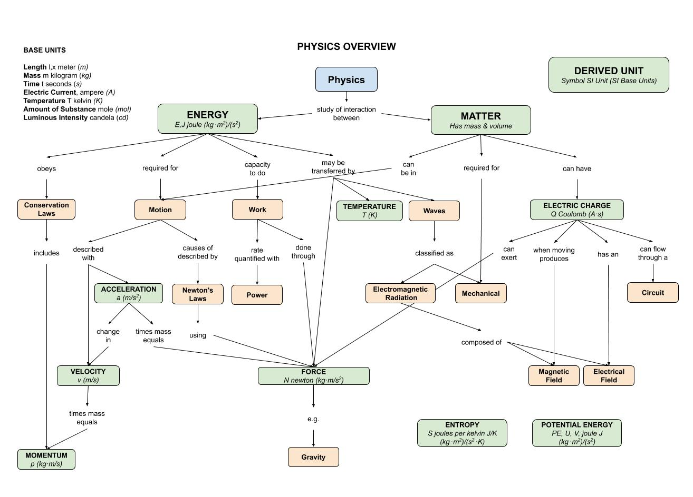

# PHYSICS CHEAT SHEET

```txt
*** THIS CHEAT SHEET IS UNDER CONSTRUCTION - CHECK BACK SOON ***
```

`physics` _helps describe everything around us._

* [OVERVIEW](https://github.com/JeffDeCola/my-cheat-sheets/tree/master/other/science/physical-science/physics-cheat-sheet#overview)
  * [IMPORTANT DISCOVERIES IN PHYSICS]()
* [UNITS AND PHYSICAL QUANTITIES]()
  * [FUNDAMENTAL AND DERIVED UNITS]()
  * [PHYSICAL QUANTITIES]()

This cheat sheet was built using,

* LaTex Math Mode equations rendered to images using
  [readme2tex-pgfplots](https://github.com/JeffDeCola/readme2tex-pgfplots)
* Graphs were created in
  [my-latex-graphs](https://github.com/JeffDeCola/my-latex-graphs)
  repo using the LaTeX graph packages

You can see my
[Latex](https://github.com/JeffDeCola/my-cheat-sheets/tree/master/software/development/languages/latex-cheat-sheet)
and
[LaTeX Math Mode](https://github.com/JeffDeCola/my-cheat-sheets/blob/master/software/development/languages/latex-cheat-sheet/latex-math-mode.md)
cheat sheets for more information.

View my entire list of cheat sheets on
[my GitHub Webpage](https://jeffdecola.github.io/my-cheat-sheets/).

## OVERVIEW

Why are things the way they are, we try to understand.
IT is the study of the properties of matter and their relationship with energy
and forces.

Physics can be subdivided into the following,

* `CLASSICAL PHYSICS`
  * This cheat sheet
  * Isaac Newton is credited with many classical physics theories.
  * This is further broken down into
    * `MATTER`
      * The various states of matter and their properties.
    * `MECHANICS`
      * Concerns `forces` such as `gravity` and
      * The motion (`velocity`, `acceleration`) of objects.
    * `WAVE MOTION`
      * Special application of mechanics. It mainly concerns sound waves
        and electromagnetic waves.
    * `WORK AND ENERGY`
      * Heat is the internal energy of a material.
      * Kinetic
      * Potential
      * Power
      * Temperature as (heat and cold)
    * `ELECTRICITY AND MAGNETISM`
      * General electricity
      * Static electricity
      * Direct current (DC) electricity
      * Alternating current (AC) electricity
      * Magnetism
      * Electromagnetism
    * `LIGHT AND OPTICS`
      * Light as a wave
      * Light as a particle
* `RELATIVITY`
  * Concerns what happens to matter, space, and time at extremely high speeds
  or velocities.
* `QUANTUM MECHANICS`
  * Concerns extremely small sizes and distances

### IMPORTANT DISCOVERIES IN PHYSICS

* Nicholas Copernicus - discovered that the Earth rotates around the Sun.
* Galileo - demonstrated that heavy objects do not fall faster than lighter
  ones in his famous Leaning Tower of Pisa experiment.
* Isaac Newton - published the three laws of motion and explained how gravity works.
* John Dalton - described the atom and the atomic theory of matter.
* Albert Einstein - published the theory of relativity.
* Max Planck - described quantum theory.

## UNITS AND PHYSICAL QUANTITIES

 A physical quantity either defined by,

* Specifying how it is measured (e.g. like distance and time)
* Stating how it is calculated from other measurements (e.g. speed is distance
  over time).

Measurements of physical quantities are expressed in terms of units (e.g. meters
or seconds).

### FUNDAMENTAL AND DERIVED UNITS

Fundamental units are,

* LENGTH
  * meter (m)
* MASS
  * kilogram (kg)
* TIME
  * seconds (s)
* ELECTRIC CURRENT
  * ampere (A)
* TEMPERATURE
  * kelvin (K)
* AMOUNT OF SUBSTANCE
  * mole (mol)
* LUMINOUS INTENSITY
  * candela (cd)  

There is a massive list of derived units, here are popular ones.

* hertz (Hz)
* radian (rad)
* watt (W)
* ElecVolt (V)
* Work - joule (J)
* Area - Square meter ($m2$)
* Volume - cubic meter - ($m3$)
* Force (N)

### PHYSICAL QUANTITIES

Basic quantities are,

* `Motion`
  * `VELOCITY`
    * The rate of change of its position with respect to a frame of reference,
      and is a function of time
  * `ACCELERATION`
    * Rate of change of velocity of an object with respect to time.
* `ELECTRIC CHARGE`
  * Is the physical property of matter that can experience a force
    when placed in an electromagnetic field.
  * Has an `electric field`
  * When moving produces a `magnetic field`
  * Can flow though a `circuit`.
* `ENERGY`
  * Must be transferred to an object in order to perform work on, or to heat,
    the object
  * Concerns the velocity of matter
  * Capacity to do `work`
* `ENTROPY`
* `FORCE`
  * Is any interaction that, when unopposed, will change the motion of an object
  * Such as `gravity`
* `LENGTH`
  * Measure of distance
* `MASS`
  * Both a property of a physical body and
  * A measure of its resistance to acceleration (a change in its state of motion)
    when a net force is applied
* `MATTER`
  * `Objects` that have mass a volume (take up space)
* `MOMENTUM`
  * Product of the mass and `velocity` of an `object`
* `POTENTIAL ENERGY`
  * Is the `energy` held by an `object` because of its position relative
    to other `objects`
* `SPACE`
  * Is the boundless three-dimensional extent in which `objects`
    and events have relative position and direction.
* `TEMPERATURE`
  * Is a physical quantity expressing `hot` and `cold`
* `TIME`

This illustration may help,


