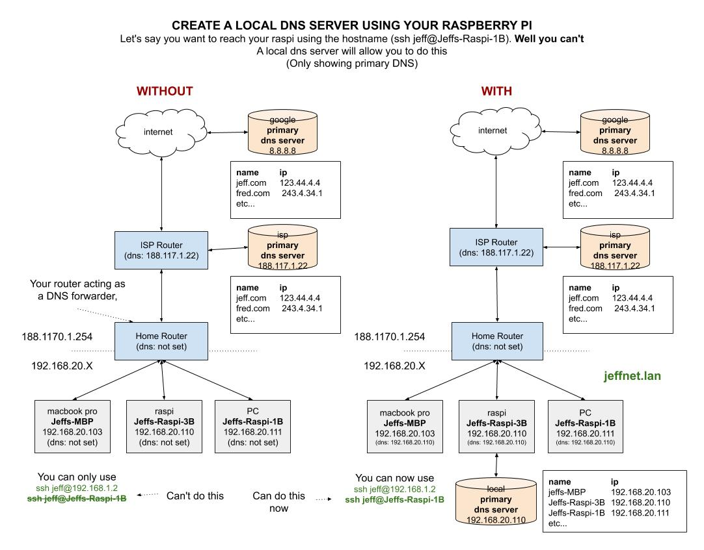

# CREATE DNS SERVER CHEAT SHEET

`create-dns-server` _on your Raspberry Pi._

* [WHY DO WE NEED A LOCAL DNS SERVER](https://github.com/JeffDeCola/my-cheat-sheets/tree/master/other/single-board-computers/raspberry-pi/create-dns-esrver-cheat-sheet#why-do-we-need-a-local-dns-server)
* [BENEFITS](https://github.com/JeffDeCola/my-cheat-sheets/tree/master/other/single-board-computers/raspberry-pi/create-dns-esrver-cheat-sheet#benefits)
* [WHAT DNS IS YOUR MACHINE USING](https://github.com/JeffDeCola/my-cheat-sheets/tree/master/other/single-board-computers/raspberry-pi/create-dns-esrver-cheat-sheet#what-dns-is-your-machine-using)
* [INSTAL & CONFIGURE BIND (DNS SERVER)](https://github.com/JeffDeCola/my-cheat-sheets/tree/master/other/single-board-computers/raspberry-pi/create-dns-esrver-cheat-sheet#install--configure-bind-dns-server)
* [CONFIGURING DHCP ON YOUR ROUTER](https://github.com/JeffDeCola/my-cheat-sheets/tree/master/other/single-board-computers/raspberry-pi/create-dns-esrver-cheat-sheet#configure-dhcp-on-your-router)
* [TEST](https://github.com/JeffDeCola/my-cheat-sheets/tree/master/other/single-board-computers/raspberry-pi/create-dns-esrver-cheat-sheet#test)

I want to credit Dani from
[domoticproject.com](https://domoticproject.com/configuring-dns-server-raspberry-pi/)
for most of this information.

View my entire list of cheat sheets on
[my GitHub Webpage](https://jeffdecola.github.io/my-cheat-sheets/).

## WHY DO WE NEED A LOCAL DNS SERVER

Most likely your home router is acting as a DNS forwarder;
You ask your router and your router send its up to the next router.
The ISP router has it set to asks its own ISP DNS server.
You could overide this and set your router to ask google DNS, or
set this request for each machine. ** So the bottom line, the
request gets passed upstream till someone figures it out.**

So how do you reach your raspberry pi from another device?  You muse the ip address.
You can't use the hostname.  You must use,

```bash
ssh jeff@192.168.1.2
```

But if you had a home dns server, it could resolve those names
for your home network.

This illustration may help,



## BENEFITS

From the above illustration, the benefits are apparent,

* You can now use hostname of your local machines.
* Your local DNS can cache certain website so now you do not always have to ask
  your ISP DNS or google DNS server.  This is faster.
* Security, your local requests won't go outside your home network.

## WHAT DNS IS YOUR MACHINE USING

First let find what dns you are currently using.

```bash
cat /etc/resolv.conf
```

For Linux,

```bash
nmcli device show enp1s0

```

For macos,

```bash
scutil --dns | grep 'nameserver\[[0-9]*\]'
```

## INSTAL & CONFIGURE BIND (DNS SERVER)

BIND (Berkley Internet Naming Daemon) is the most common program
used for maintaining a name server on Linux.

```bash
sudo apt-get install bind9 bind9-doc dnsutils
```

Check status,

```bash
service bind9 status
```

All DNS configurations for BIND are located under /etc/bind.

* `named.conf` - Primary configuration.
* `named.conf.options` - Port to listen, the forwarders to use, etc.
* `named.conf.local` - This file has the local DNS server configuration.
* `named.conf.default.zones` - It contains the default zones of the server.

Lets configure,

```bash
sudo nano /etc/bind/named.conf
```

With,

```txt
# Access Control List that includes the loopback interface and the local network
acl internals {
127.0.0.0/8;
192.168.1.0/24;
};

options {

directory "/var/cache/bind";
auth-nxdomain no;
# Forward queries to:
forwarders {
8.8.8.8; # Google DNS
9.9.9.9; # IMB Quad9 DNS
192.168.1.1; # ISP DNS (router's own DNS)
};

# Listen port 43 from loopback and our own IP Address
listen-on port 53 {
127.0.0.1;
192.168.1.100;
};

# Don't listen IPv6 traffic
listen-on-v6 {
none;
};

# Allow queries from loopback and our internal network
allow-query {
internals;
};

# Do not transfer the zone information to the secondary DNS
allow-transfer {
none;
};

// Allow recursive queries to the local host
allow-recursion {
internals;
};

};
```

Lets configure,

```bash
sudo nano /etc/bind/named.conf.local
```

With,

```txt
zone "YOURHOSTNAME" {
type master;
file "/etc/bind/YOURHOSTNAME.db";
};
```

And copy the database here,

```bash
sudo cp /etc/bind/db.local YOURHOSTNAME.db
```

Now open the database file,

```bash
sudo nano /etc/bind/YOURHOSTNAME.db
```

I did not edit this file.

Verify no error with your configuration files. Should return nothing,

```bash
sudo named-checkconf
```

## CONFIGURING DHCP ON YOUR ROUTER

There are two ways to do this, in each device or at the router.

Lets use the router.

On your router set `DHCP` to your raspberry pi IP address.

## TEST


networksetup -listnetworkserviceorder
networksetup -getdnsservers "Wi-Fi"
networksetup -getdnsservers "Thunderbolt Ethernet Slot 1"
```