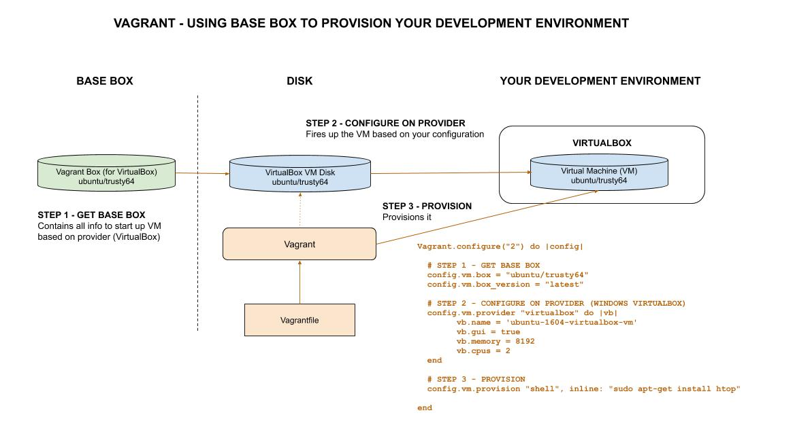

# VAGRANT CHEAT SHEET

`vagrant` _creates and configures (manages) portable development environments._

Check out my repo [my-vagrant-boxes](https://github.com/JeffDeCola/my-vagrant-boxes).

View my entire list of cheat sheets on
[my GitHub Webpage](https://jeffdecola.github.io/my-cheat-sheets/).

## OVERVIEW

Vagrant provides the same production environment (_OS,
packages, users, configuration, etc..._) giving developers the
flexibility to use there own tools (_browsers, IDEs, editors, etc..._).

Vagrant can match the development environment to the
production environment. _"Well it worked on my computer"_
is a statement of the past.

Vagrant can run on providers such as,

* VirtualBox
* KVM
* Hyper-V
* Docker
* VMware
* AWS



## INSTALL

Visit [vagrant downloads](https://www.vagrantup.com/downloads.html).

## CHECK VERSION

```bash
vagrant version
```

## FIND VAGRANT BOXES

Search for vagrant boxes at
[vagrant box search](https://app.vagrantup.com/boxes/search).

## VAGRANTFILE

Vagrants uses a declarative config file which describes your
software requirements, packages, OS configuration, users, etc..

Lets say we want to kick off a vagrant box on docker. I found a
box for ubuntu-16.04 called `tknerr/baseimage-ubuntu-16.04`. 

So my vagrant file could look life the following,

```code
Vagrant.configure("2") do |config|
  config.vm.box = "tknerr/baseimage-ubuntu-16.04"
  config.vm.box_version = "1.0.0"
end
```

##  EXAMPLE - KICK OFF A DOCKER CONTAINER UBUNTU 16.04

Lets get the vagrant box `tknerr/baseimage-ubuntu-16.04`,

```bash
vagrant box add tknerr/baseimage-ubuntu-16.04
```

Initialize,

```bash
vagrant init tknerr/baseimage-ubuntu-16.04
```

List boxes on your machine,

```bash
vagrant box list
```

Within the directory with your vagrantfile

```bash
vagrant up
```

## YOUR LOCAL VAGRANT BOXES

To list boxes on your machine,

```bash
vagrant box list
```

To add a box (e.g. ubuntu/trusty64),

```bash
vagrant box add ubuntu/trusty64
```

To update all boxes,

```bash
vagrant box update
```

To update a particular box,

```bash
vagrant box update --box NAME
```

To destroy all old boxes,

```bash
vagrant box destroy
```
