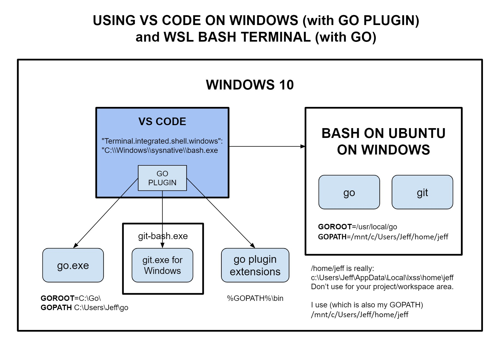

# VISUAL STUDIO CODE CHEAT SHEET

`visual studio code` _is a code development environment._

This cheat-sheet is heavy on Windows and go, and I probably
should of called it `VS Code for Windows using go`.

View my entire list of cheat sheets on
[my GitHub Webpage](https://jeffdecola.github.io/my-cheat-sheets/).

## INSTALL ON LINUX OR WINDOWS

Most, if not all of the time VS Code will be
install on Linux.  But a few crazy people like
to use Windows as a Dev Environment.

Go to [code.visualstudio.com](https://code.visualstudio.com/)
for how to install.

## CONFIGURE - LINUX

This is pretty straight forward and not sure how I
could add anything else useful.

## CONFIGURE - WINDOWS VERSION OF VS CODE

Visual Studio Code on Windows will ALWAYS run on Windows.
Hence, you want to edit your files in Windows realm, not linux.

### SET YOUR INTEGRATED TERMINAL

After you have installed VS Code, goto your user
settings.json (press F1) and set
VS Code integrated terminal to point to WSL bash.

For Ubuntu 14.04 on Windows,

```yaml
"terminal.integrated.shell.windows": "C:\\Windows\\sysnative\\bash.exe",
```

For Ubuntu 18.04 on Windows,

```yaml
"terminal.integrated.shell.windows": "C:\\Users\\Jeff\\AppData\\Local\\Microsoft\\WindowsApps\\ubuntu1804.exe",
```

You now can use your Windows linux bash shell in VS Code.

### CREATE A WORKING/PROJECT DIRECTORY

Now we want to change your working directory (where you edit your files).

As we know, bash home is `/home/<bashusername>`.

This directory is actually located for Ubuntu 14.04,

```
C:\Users\<WindowsNAME>\AppData\Local\lxss\home\<bashusername>
```

And for Ubuntu 18.04,

```
C:\Users\<WindowsNAME>\AppData\Local\Packages\CanonicalGroupLimited.UbuntuonWindows_79rhkp1fndgsc\LocalState\rootfs\home\<bashusername>
```

DO NOT touch these files.  If you do, only edit using
a bash editor like nano.

So if you can't edit in this area, you need
to put your project files somewhere else.

I created the following directory path to keep my projects/working area,

```
/mnt/c/Users/<winusername>/home/<bashusername>
```

Note, `/mnt/c` in WSL is the exact same as `C:` in Windows.

Set the working area in VS code to open in this directory.

The bottom line. Your Ubuntu home is,

```
\Users\<WindowsNAME>\AppData\Local\lxss\home\<bashusername>
\Users\<WindowsNAME>\AppData\Local\Packages\CanonicalGroupLimited.UbuntuonWindows_79rhkp1fndgsc\LocalState\rootfs\home\<bashusername>
```

But your projects/working directory is,

```
/mnt/c/Users/<winusername>/home/<bashusername>
```

And your prompt should look like,

```bash
<bashusername>@<computername>:/mnt/c/Users/<winusername>/home/<bashusername>
```

### FIX EOL (END-Of-LINE) CRLF TO LF FOR WINDOWS

Since windows will like uses CRLF at eol (end of line), and linux uses LF,
you need to force your windows VS Code to always use LF.

Set this in your preferences settings.json (press F1),

```json
"files.eol": "\n"
```

You can check it worked by looking in the bottom right of your VS Code
and you will see LF.

## INSTALLING EXTENSIONS

Most extensions are standalone and they live in the following directories,

* Windows `Users\Jeff\vscode\extensions`
* macOS `~/.vscode/extensions`
* Linux `~/.vscode/extensions`

Some extensions, like `go` and `python` use existing Apps/Tools.

For example, to get the extension `shellcheck` to run on Windows, you
would bring up settings.json (press F1) and add the path to the program,

```yaml
    "shellcheck.executablePath": "C:\\Users\\Jeff\\AppData\\Local\\Programs\\shellcheck\\shellcheck-stable.exe",
```

## USING GO with WINDOWS VS CODE and BASH WSL TERMINAL

That is a mouthful and the setup took me a minute to
figure out because you actually need two versions of go.

### DIAGRAM

Here's a diagram that might help explain what's going on



### WHAT YOU NEED ON WINDOWS

You will need to install the following on windows,

* [go](https://golang.org/doc/install)
* [git for windows](https://git-scm.com/downloads)
* Obviously VS Code.

When you install go for Windows, it should set the paths as follows,

```bash
GOROOT=C:\Go\
GOPATH C:\Users\<WINDOWSNAME>\go
Path=...\Go\bin;...%GOPATH%\bin
```

You may need to create your workspace directory for Windows go
if it didn't do it automatically.

To check everything, open a windows command prompt and
type the following,

* `set` check the go paths above
* `go version`
* `git version`

### TWO VERSION OF GO (VS CODE and TERMINAL)

As I mentioned, their are two versions of go, one for Windows and
one for your WSL bash.  And each have their own paths.

#### INSTALLING THE GO EXTENSION

So when you open VS Code, and install the go extension, it will
install in the windows area of go. The go extensions will
automatically be placed in

`C:\Users\<WINDOWSNAME>\go\bin`

#### USING PACKAGES

Usually you would do something like

```go
import "github.com/JeffDeCola/package/path"
```

For the go extension it's looking in its GOPATH and
the terminal bash is looking in its own GOPATH.

I solve this by copying the package from my bash GOPATH to
my Windows GOPATH.

As an example,

```go
cp <YOURPACKAGE>.go /mnt/c/Users/Jeff/go/src/github.com/JeffDeCola/package/path/.
```

I'm sure there is a better solution, but this works for me.

That's it, you're good to go.
