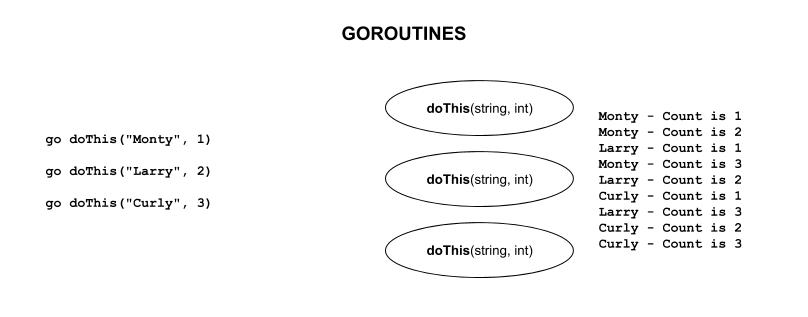
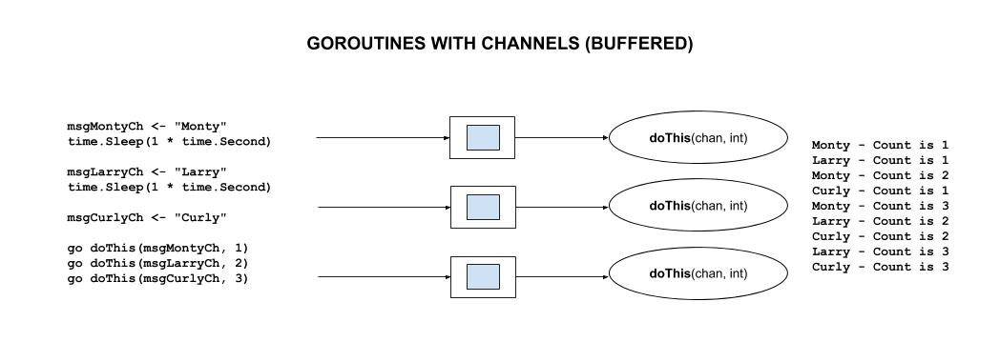

# GOROUTINES & CHANNELS

`goroutines` are lightweight concurrent threads of execution `go func()`
where `channels` are pipes that allow them to message each other.
This is a huge benefit of go since it can use multi-core environments.

tl;dr,

```go
// GOROUTINES - CONCURRENT THREADS
    func doThis(s string) {
        do stuff
    }
    go doThis("Jeff")                               // Kick off goroutine
// CHANNELS - GOROUTINE MESSAGE PIPES
    // SEND & RECEIVE
    msgCh := make(chan type, size)                  // name := make(chan type, buffer size)
    msgCh <- type                                   // SEND
    type := <-msgCh                                 // RECEIVE
    // NOT BUFFERED
    func doThis(msgCh <-chan string, t int) {
        rcv := <-msgCh                              // RECEIVE
        do stuff
    }
    msgJeffCh := make(chan string)                  // name := make(chan type)
    go doThis(msgJeffCh)                            // Kick off goroutine
    msgJeffCh <- "Jeff"                             // SEND
    // BUFFERED
    msgCh := make(chan string, 1)                   // name := make(chan type, buffer size)
    // CHANNEL DIRECTION (MORE EXPLICIT)
    func doThis(msgCh <-chan string, t int) {
    // SELECT (CASE) - WAITING FOR BOTH CHANNELS TO BE RECEIVED
    select {
    case msg1 := <-c1:
        fmt.Println("received", msg1)
    case msg2 := <-c1:
        fmt.Println("received", msg2)
```

Table of Contents,

* [GOROUTINES - CONCURRENT THREADS](https://github.com/JeffDeCola/my-cheat-sheets/tree/master/software/development/languages/go-cheat-sheet/goroutines-and-channels.md#goroutines---concurrent-threads)
* [CHANNELS - GOROUTINE MESSAGE PIPES](https://github.com/JeffDeCola/my-cheat-sheets/tree/master/software/development/languages/go-cheat-sheet/goroutines-and-channels.md#channels---goroutine-message-pipes)
  * [NOT BUFFERED](https://github.com/JeffDeCola/my-cheat-sheets/tree/master/software/development/languages/go-cheat-sheet/goroutines-and-channels.md#not-buffered)
  * [BUFFERED](https://github.com/JeffDeCola/my-cheat-sheets/tree/master/software/development/languages/go-cheat-sheet/goroutines-and-channels.md#buffered)
  * [CHANNEL DIRECTION (MORE EXPLICIT)](https://github.com/JeffDeCola/my-cheat-sheets/tree/master/software/development/languages/go-cheat-sheet/goroutines-and-channels.md#channel-direction-more-explicit)
  * [SELECT](https://github.com/JeffDeCola/my-cheat-sheets/tree/master/software/development/languages/go-cheat-sheet/goroutines-and-channels.md#select)
* [MULTI-CORE (Parallelism)](https://github.com/JeffDeCola/my-cheat-sheets/tree/master/software/development/languages/go-cheat-sheet/goroutines-and-channels.md#multi-core-parallelism)

For goroutine and channel examples, see
[my-go-examples](https://github.com/JeffDeCola/my-go-examples#goroutines).

## GOROUTINES - CONCURRENT THREADS

A goroutine is a lightweight thread/process/etc... of execution.
It will run concurrently. The Go runtime multiplexes goroutines to
operating system (OS) threads.

```go
// OUR GOROUTINE (Counts to 3)
func doThis(s string, t int) {
    for i := 1; i < 4; i++ {
        time.Sleep(time.Duration(t) * time.Second)
        fmt.Printf("%v - Count is %v\n", s, i)
    }
}

func main() {

    // START goroutines
    go doThis("Monty", 1)                       // Kick off goroutines
    time.Sleep(1 * time.Second)
    go doThis("Larry", 2)
    time.Sleep(1 * time.Second)
    go doThis("Curly", 3)

    // WAIT TILL DONE
    fmt.Scanln()
    fmt.Println("done")
}
```



## CHANNELS - GOROUTINE MESSAGE PIPES

Channels are pipes that connect the concurrent goroutines.
To declare a channel the syntax is,

```go
msgCh := make(chan type, size)                      // name := make(chan type, buffer size)
msgCh <- type                                       // SEND
type := <-msgCh                                     // RECEIVE
```

### NOT BUFFERED

```go
// OUR GOROUTINE (Counts to 3)
func doThis(msgCh chan string, t int) {
    for {
        rcv := <-msgCh                              // RECEIVE
        for i := 1; i < 4; i++ {
            time.Sleep(time.Duration(t) * time.Second)
            fmt.Printf("%v - Count is %v\n", rcv, i)
        }
    }
}

func main() {

    // DECLARE CHANNEL
    msgMontyCh := make(chan string)                 // name := make(chan type)
    msgLarryCh := make(chan string)
    msgCurlyCh := make(chan string)

    // START goroutines
    go doThis(msgMontyCh, 1)                        // Kick off goroutines
    go doThis(msgLarryCh, 2)
    go doThis(msgCurlyCh, 3)

    // SEND
    msgMontyCh <- "Monty"                           // SEND
    time.Sleep(1 * time.Second)
    msgLarryCh <- "Larry"                           // SEND
    time.Sleep(1 * time.Second)
    msgCurlyCh <- "Curly"                           // SEND

    // WAIT TILL DONE
    fmt.Scanln()
    fmt.Println("done")
```


### BUFFERED

Adds some elasticity for messaging.

```go
// OUR GOROUTINE (Counts to 3)
func doThis(msgCh chan string, t int) {
    for {
        rcv := <-msgCh                              // RECEIVE
        for i := 1; i < 4; i++ {
            time.Sleep(time.Duration(t) * time.Second)
            fmt.Printf("%v - Count is %v\n", rcv, i)
        }
    }
}

func main() {

    // DECLARE CHANNEL WITH BUFFER OF 1
    msgMontyCh := make(chan string, 1)              // name := make(chan type)
    msgLarryCh := make(chan string, 1)              // BUFFER 1
    msgCurlyCh := make(chan string, 1)

    // START goroutines
    go doThis(msgMontyCh, 1)                        // Kick off goroutines
    go doThis(msgLarryCh, 2)
    go doThis(msgCurlyCh, 3)

    // SEND
    msgMontyCh <- "Monty"                           // SEND
    msgMontyCh <- "Monty2"                          // SEND
    time.Sleep(1 * time.Second)
    msgLarryCh <- "Larry"                           // SEND
    msgLarryCh <- "Larry2"                          // SEND
    time.Sleep(1 * time.Second)
    msgCurlyCh <- "Curly"                           // SEND
    msgCurlyCh <- "Curly2"                          // SEND

    // WAIT TILL DONE
    fmt.Scanln()
    fmt.Println("done")
```



### CHANNEL DIRECTION (MORE EXPLICIT)

When using channels as function parameters,
you can specify if a channel is meant to only send or receive values.

So for the above example just change,

```go
func doThis(msgCh chan string, t int) {
```

to

```go
func doThis(msgCh <-chan string, t int) {
```

Honestly, I find this a little to nit picky.

### SELECT

Go’s select lets you wait on multiple channel operations.

```go
select {
case msg1 := <-c1:
    fmt.Println("received", msg1)
case msg2 := <-c1:
    fmt.Println("received", msg2)
```

## MULTI-CORE (Parallelism)

A few things to note,

* A go executable (or binary) is made up of your compiled go code and
  the go runtime environment.  Refer to
  [executable (your code and go runtime)](https://github.com/JeffDeCola/my-cheat-sheets/tree/master/software/development/languages/go-cheat-sheet/executable-your-code-and-go-runtime.md)
  for more information
* `Parallelism` is when you can truly run things at the same time.  Hence you
  need physical hardware to do that (e.g. multi-core)
* `goroutines` like to run on one core because of the
  go runtime is scheduling the goroutines
* So when you really think about it, **goroutines are not parallelism**
* A goroutine is also not a thread, but really runs above it,
  goroutines are more lightweight
* A goroutine will jump around threads unless you lock it.  
* A thread is just a sequence of instructions that can be
  executed independently by a processor
* No forking allowed in go because forks and threads do not mix

Refer to my example on running goroutines on multi-cores
[here](https://github.com/JeffDeCola/my-go-examples/tree/master/goroutines/goroutines-multi-core).
