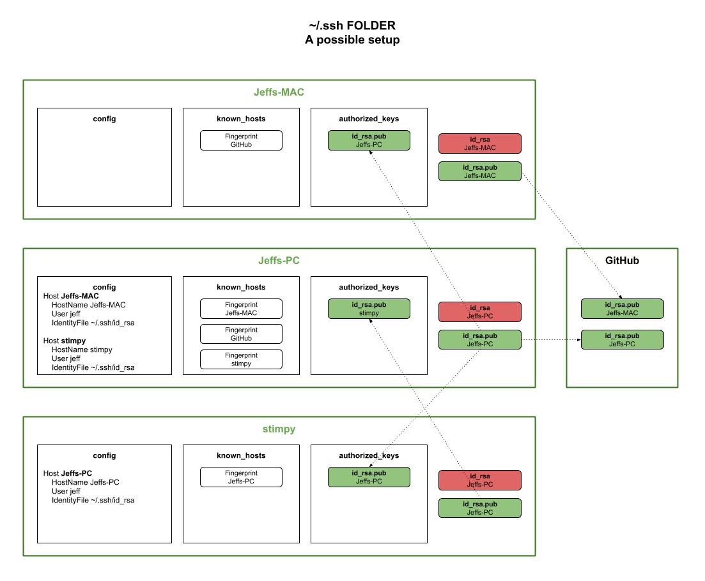

# SSH & KEYS CHEAT SHEET

`ssh and keys` _(secure socket shell) is a way to securely
communicate (via ssh keys) with a remote computer._

tl;dr,

```bash
# KEYS
ssh-keygen -t rsa -b 4096 -C "Keys for Github <MACHINE/HOSTNAME>"
ssh-keygen -E md5 -lf ~/.ssh/id_rsa.pub
ssh-copy-id user@<IP>
## SSH CONFIGURATION FILE (EASY LOGIN)
nano ~/.ssh/config
# Host stimpy
#    HostName stimpy
#    User jeff
#    IdentityFile ~/.ssh/id_rsa
ssh stimpy
# SSH EXAMPLES
ssh user@<IP>
ssh -v -p 22 user@<HOSTNAME>
ssh -i ~/.vagrant.d/insecure_private_key -p 2222 vagrant@127.0.0.1
ssh stimpy "ls -lat"
# COPY TO REMOTE
scp test1.txt jeff@stimpy:~/
scp -r testdirectory1 jeff@stimpy:~/
# COPY FROM REMOTE
scp jeff@stimpy:~/test2.txt ~/
scp -r jeff@stimpy:testdirectory2 ~/
```

* [KEYS](https://github.com/JeffDeCola/my-cheat-sheets/tree/master/software/development/operating-systems/linux/ssh-and-keys-cheat-sheet#keys)
  Generate and use
* [SSH CONFIGURATION](https://github.com/JeffDeCola/my-cheat-sheets/tree/master/software/development/operating-systems/linux/ssh-and-keys-cheat-sheet#ssh-configuration)
  Configure ssh
* [SSH EXAMPLES](https://github.com/JeffDeCola/my-cheat-sheets/tree/master/software/development/operating-systems/linux/ssh-and-keys-cheat-sheet#ssh-examples)
  Cool commands to use

View my entire list of cheat sheets on
[my GitHub Webpage](https://jeffdecola.github.io/my-cheat-sheets/).

## KEYS

Its a way to receive encrypted data from a server.

### SEQUENCE

Its a way to receive encrypted data from a server.
Really just another way to 'login' to a server.

Sequence:

* You create both a public and private key.
* You give the remote computer your public key.
* You keep your private key and NEVER share.
* The server encrypts the data and sends it to you.
* You use your private key to decrypt it.

If the data went anywhere else, it would need your private
key to decrypt.

Here is an illustration using ssh for github,



### GENERATE KEYS (ssh-keygen)

A way to generate public and private keys.

For example,

```bash
ssh-keygen -t rsa -b 4096 -C "Keys for Github <MACHINE/HOSTNAME>"
```

* -t switch is the `rsa` type key (very popular).
* -b switch is the length in bits.
* -C is a comment for this key.

This will create two keys and place them in
`~/.ssh` with default names as `id_rsa` and `id_rsa.pub`.

I'm not a fan of using a paraphrase (password), because I'll
forget.  Its up to you if you want an extra level of protection if
by chance someone was on your computer being mischievous or if
someone stole your keys.  Hey, maybe you pushed your private key
to github by accident.

### KEY FINGERPRINT (ssh-keygen)

Sometimes it gets confusing with lots of keys, so you
can check your public key fingerprint to make sure your
server is using the right public key.

If you public key is located in `~/.ssh/id_rsa.pub`

```bash
ssh-keygen -E md5 -lf ~/.ssh/id_rsa.pub
```

### SSH - ADD YOUR PRIVATE KEY TO YOUR SSH AGENT (ssh-add)

Now add your key,

```bash
ssh-add ~/.ssh/id_rsa
```

## SSH CONFIGURATION

Another way to communicate to a remote computer without
traditional username/password `login`.

It stands for secure shell and uses port 22.

Remote will mean the ssh server and local will be the ssh client machine.

### SSH REMOTE SERVER SETUP

If you want to ssh into a machine, that machine must have a ssh server running.

To install on ubuntu, on the remover machine,

```bash
sudo apt-get install openssh-server
sudo systemctl start ssh
sudo systemctl enable ssh
```

Now from your local terminal (ssh client), push the public key
from your local machine to the remote ssh server,

```bash
ssh-copy-id user@<IP>
```

Or you can login to the remote ssh server machine and manually
add the public key to `.ssh/authorized_keys`.

### MAKE YOUR SSH SERVER SECURE - NO PASSWORDS

```bash
sudo nano /etc/ssh/sshd_config
```

And change the following to only allow ssh,

```bash
Protocol 2
PermitRootLogin no
MaxAuthTries 6
#PermitRootLogin prohibit-password
PubkeyAuthentication yes
IgnoreRhosts yes
PasswordAuthentification no
PermitEmptyPasswords no
X11Forwarding no
```

Restart ssh service,

```bash
sudo systemctl reload sshd.service
```

If you ever want to add another ssh client, you need to
turn `PasswordAuthentification yes` and then upload
your ssh public key as above to `.ssh/authorized_keys`.

### SSH CONFIGURATION FILE

Make it easier to ssh into servers without typing everything,

edit,

```bash
nano ~/.ssh/config
```

with,

```txt
Host st
    # HostName 192.168.20.102
    HostName stimpy
    User jeff
    IdentityFile ~/.ssh/id_rsa
```

Then just do a small command of,

```bash
ssh st
```

## SSH EXAMPLES

Some cool examples

### SSH CLIENT - FROM YOUR TERMINAL - TO REMOTE LOGIN

From command line,

```go
ssh user@<IP>
ssh -v -p 22 user@<HOSTNAME>
```

Again, no password is needed.

In this example I am using a particular private key and port.
This is useful to ssh on a vagrant made virtualbox VM.

```bash
ssh -i ~/.vagrant.d/insecure_private_key -p 2222 vagrant@127.0.0.1
```

Again, put this info in `~/.ssh/config` so you don't have to type all the time.

### RUN COMMANDS REMOTELY

```bash
ssh stimpy "ls -lat"
```

### COPY LOCAL TO REMOTE

```bash
scp test1.txt jeff@stimpy:~/
scp -r testdirectory1 jeff@stimpy:~/
```

### COPY REMOTE TO LOCAL

```bash
scp jeff@stimpy:~/test2.txt ~/
scp -r jeff@stimpy:testdirectory2 ~/
```
