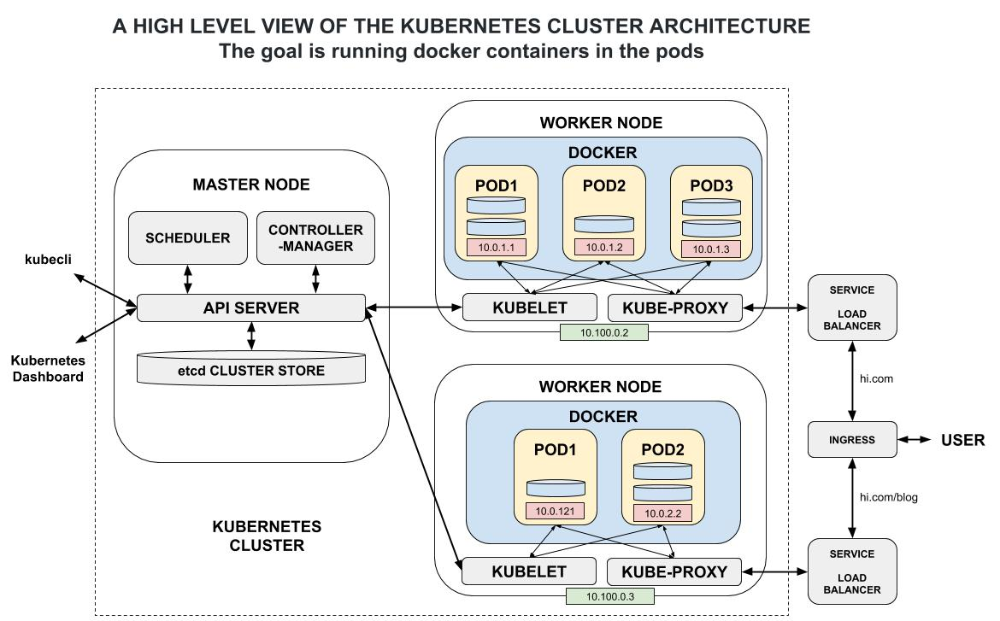

# KUBERNETES CHEAT SHEET

`kubernetes` _is a container orchestration platform.
Automating the deployment, scaling and management of containers._

Documentation and reference,

* [Kubernetes Documentation](https://dcos.io/)
* [kubectl (Kubernetes cli)](https://kubernetes.io/docs/reference/kubectl/overview/)

My CaaS cheat sheets and repos are,

  * [Amazon - elastic container service for kubernetes (eks)](https://github.com/JeffDeCola/my-cheat-sheets/tree/master/software/service-architectures/containers-as-a-service/amazon-elastic-container-service-for-kubernetes-cheat-sheet),
    [hello-go-deploy-amazon-eks](https://github.com/JeffDeCola/hello-go-deploy-amazon-eks)
  * [Google - kubernetes engine (gke)](https://github.com/JeffDeCola/my-cheat-sheets/tree/master/software/service-architectures/containers-as-a-service/google-kubernetes-engine-cheat-sheet),
    [hello-go-deploy-gke](https://github.com/JeffDeCola/hello-go-deploy-gke)
  * [Microsoft - azure kubernetes service (aks)](https://github.com/JeffDeCola/my-cheat-sheets/tree/master/software/service-architectures/containers-as-a-service/microsoft-azure-kubernetes-service-cheat-sheet),
    [hello-go-deploy-aks](https://github.com/JeffDeCola/hello-go-deploy-aks)

View my entire list of cheat sheets on
[my GitHub Webpage](https://jeffdecola.github.io/my-cheat-sheets/).

## OVERVIEW

Kubernetes is a container orchestration platform. It
automates the following on your containers,

* Deployment
* Scaling
* Management

Here is a high level view of a Kubernetes Cluster,



## INSTALL KUBERNETES CLUSTER

I use CaaS to create Kubernetes Clusters,

* [Amazon eks](https://github.com/JeffDeCola/my-cheat-sheets/tree/master/software/service-architectures/containers-as-a-service/amazon-elastic-container-service-for-kubernetes-cheat-sheet)
* [Google gke](https://github.com/JeffDeCola/my-cheat-sheets/tree/master/software/service-architectures/containers-as-a-service/google-kubernetes-engine-cheat-sheet)
* [Microsoft aks](https://github.com/JeffDeCola/my-cheat-sheets/tree/master/software/service-architectures/containers-as-a-service/microsoft-azure-kubernetes-service-cheat-sheet)

## KUBECTL

`kubectl` is a cli for running kubernetes commands.

Install from [here](https://kubernetes.io/docs/tasks/tools/install-kubectl/).

## BASIC KUBECTL COMMANDS

Some basic commands I like and use.

### NODES

List nodes in a cluster,

```bash
kubectl get nodes
```

### PODS

How many pods you have,

```bash
kubectl get pod
```

What pods are on what nodes,

```bash
kubectl get pods -o wide
```

### DEPLOY

Run/deploy a docker image from Dockerhub to gke (A `workload`),

```bash
kubectl run jeffs-web-counter \
    --image "jeffdecola/hello-go-deploy-gke:latest" \
    --port "8080"
```

This will make a container in a pod.

### SERVICE

Create a `service` - Expose a port with a load balancer,

```bash
kubectl expose deployment jeffs-web-counter
    --type LoadBalancer \
    --port 80 \
    --target-port 8080
```

Delete a `service`,

```bash
kubectl delete service jeffs-web-counter
```

Inspect a `service`,

```bash
kubectl get service jeffs-web-counter
```
