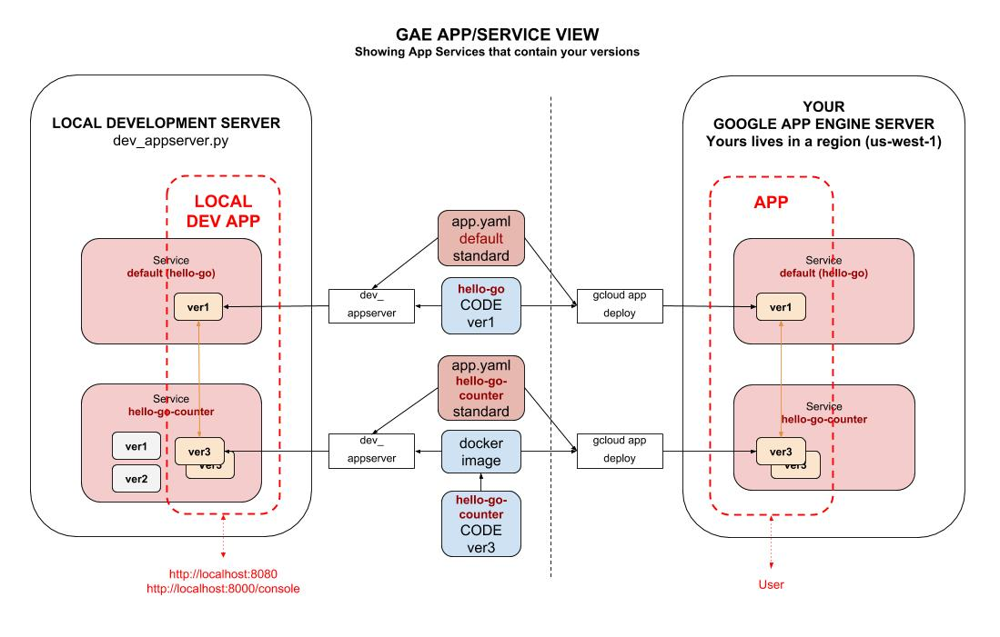

# GOOGLE APP ENGINE (GAE) CHEAT SHEET

`google app engine (gae)` _which is part of
[gcp](https://github.com/JeffDeCola/my-cheat-sheets/tree/master/software/service-providers/google-cloud-platform-cheat-sheet)
provides a serverless application platform that you can use to run an App._

Part of four main compute engines at `gcp`,

* FaaS - Google Cloud Functions
  [(gcf)](https://github.com/JeffDeCola/my-cheat-sheets/tree/master/software/service-architectures/function-as-a-service/google-cloud-functions-cheat-sheet)
* PaaS - Google App Engine
  [(gae)](https://github.com/JeffDeCola/my-cheat-sheets/tree/master/software/service-architectures/platform-as-a-service/google-app-engine-cheat-sheet)
* CaaS - Google Kubernetes Engine
  [(gke)](https://github.com/JeffDeCola/my-cheat-sheets/tree/master/software/service-architectures/containers-as-a-service/google-kubernetes-engine-cheat-sheet)
* IaaS - Google Compute Engine
  [(gce)](https://github.com/JeffDeCola/my-cheat-sheets/tree/master/software/service-architectures/infrastructure-as-a-service/google-compute-engine-cheat-sheet)

Documentation and reference,

* [Google App Engine Documentation](https://cloud.google.com/appengine/docs)
* [Quickstart standard environment using go](https://cloud.google.com/appengine/docs/standard/go/)
* [Quickstart flexible environment using go](https://cloud.google.com/appengine/docs/flexible/go/)
* [Google App Engine SDK Reference (gcloud compute)](https://cloud.google.com/sdk/gcloud/reference/app/)
* [Google app.yaml file reference](https://cloud.google.com/appengine/docs/standard/go111/config/appref)

My repo example using `gae` is
[hello-go-deploy-gae](https://github.com/JeffDeCola/hello-go-deploy-gae).

View my entire list of cheat sheets on
[my GitHub Webpage](https://jeffdecola.github.io/my-cheat-sheets/).

## OVERVIEW

What if you just don't really care about
the guts or configurations (infrastructure) and just want to
deploy and App.  Well `gae` is for you.
You bring the code, they handle the rest.

`gae` is really used for web applications, and can be used with
google firebase for mobile apps.

An App Engine app is made up of a single application resource
that consists of one or more services. Each service can be configured
to use different runtimes and to operate with different performance settings.
Within each service, you deploy versions of that service.
Each version then runs within one or more instances, depending on
how much traffic you configured it to handle.



## FREE RESOURCE (STANDARD ENVIRONMENT ONLY)

As of my last update, the free resources are,

* 28 frontend instance hours per day
* 9 backend instance hours per day
* 5 GB Cloud Storage
* 1 GB of egress per day
* Shared memcache
* 1000 search operations per day, 10 MB search indexing
* 100 emails per day

The free tier is available only for the `Standard Environment`.

Full list of [free gcp services](https://cloud.google.com/free/docs/gcp-free-tier).

## TWO ENVIRONMENTS

* STANDARD ENVIRONMENT
  * Based on container instances running on Google's infrastructure.
  * Containers are preconfigured with one of several available runtimes
    (i.e. go, python, etc...).
* FLEXIBLE ENVIRONMENT
  * The App Engine flexible environment automatically scales your app up and
    down while balancing the load.
  * Allows you to customize the runtime (i.e. go, python, etc...) and even
    the operating system of your virtual machine using Dockerfiles

## INSTALL

Must install the app-engine for gcloud,

First see if you got it,

```bash
gcloud components list
```

If you don't see it,

```bash
gcloud components update
gcloud components install app-engine-go
```

## LOCAL APP SERVER & CONSOLE

You kick off your app using the local app server `dev_appserver.py`.

And you monitor your local app in the interactive console,

[http://localhost:8000/console](http://localhost:8000/console)

Lets check this out by way of an example,

## EXAMPLE 1 - A SIMPLE EXAMPLE USING GO

Here is a very simple example using two file to test everything
is working.

You can pull the example I placed in my repo
[here](https://github.com/JeffDeCola/hello-go-deploy-gae/tree/master/example-01-gae).

### STEP 1 - CREATE TWO FILES IN A DIRECTORY

Make a directory and create the following two files,

main.go,

```go
package main

import (
    "fmt"
    "net/http"

    "google.golang.org/appengine"
)

func main() {

    http.HandleFunc("/", handle)
    appengine.Main()

}

func handle(w http.ResponseWriter, r *http.Request) {
    fmt.Fprintln(w, "Hello, world!")
}
```

app.yaml,

```yaml
runtime: go111

service: example-01-app

handlers:
- url: /.*
  script: auto
```

You will have to get the go package,

```bash
go get google.golang.org/appengine
```

You also may have to,

```bash
sudo apt-get update
sudo apt-get upgrade
go get -u github.com/golang/protobuf/{proto,protoc-gen-go}
```

### STEP 2 - TEST RUN ON YOUR LOCAL DEVELOPMENT SERVER

Test on the local development server using google's Local
App Server `dev_appserver.py`,

```bash
dev_appserver.py app.yaml
```

Check the results,

[http://localhost:8080](http://localhost:8080)

Check the interactive local console,

[http://localhost:8000/console](http://localhost:8000/console)

### STEP 3 - EDIT CODE ON THE FLY AND SEE RESULTS

Edit "hello world" to something else.

Refresh,

[http://localhost:8080](http://localhost:8080)

### STEP 4 - DEPLOY TO GAE

```bash
gcloud app deploy app.yaml
```

### STEP 5 - VIEW AT GAE

Head to the console or,

```bash
gcloud app browse
```

## EXAMPLE 2 - LETS ADD A LITTLE STRUCTURE

Lets use
[google cloud storage](https://github.com/JeffDeCola/my-cheat-sheets/blob/master/software/service-providers/google-cloud-platform-cheat-sheet/google-cloud-storage.md)
to add some static web pages.

## FILE/DIRECTOR STRUCTURE

For example 2, lets get a little more structured with some static web pages.

* example-02-app/
  * app.yaml
  * main.go (Your App code)
  * index.html (Static HTML file)
  * opps.html (Wrong URL)
  * static/ (Directory to store your static files)
    * style.css
    * go-logo.png (Picture of gopher)
  * bucket-gcs/ (Directory to store your static files on google cloud storage)
    * gae-logo.jpg

You can look at or pull the example I placed in my repo
[here](https://github.com/JeffDeCola/hello-go-deploy-gae/tree/master/example-02-gae).

## EXAMPLE 3 - LETS ADD A SERVICE

Lets do something dynamic.  How about a Webpage that
displays a running count.

You can look at or pull the example I placed in my repo
[here](https://github.com/JeffDeCola/hello-go-deploy-gae/tree/master/example-03-gae).
